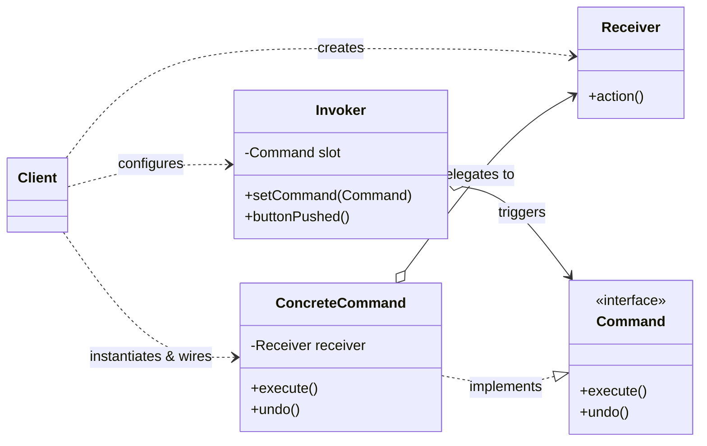

# Command Pattern

## 1. Definition

The **Command Pattern** is a behavioral design pattern that turns a request into a stand-alone object containing all information about the request. 

> **GoF Definition:**  
> *"Encapsulate a request as an object, thereby letting you parameterize clients with different requests, queue or log requests, and support undoable operations."*


> **Head First Design Patterns Definition:**  
> *"The Command Pattern encapsulates a request as an object, thereby letting you parameterize other objects with different requests, queue or log requests, and support undoable operations."*

### Core Philosophy
In traditional programming, the code that triggers an action directly calls the code that executes it (tight coupling). The Command Pattern introduces an intermediary—a **Command** object—that decouples the **Invoker** (the sender of the request) from the **Receiver** (the object that knows how to perform the action).



---

## 2. The Five Key Participants

| Role | Class in this Codebase | Responsibility |
| :--- | :--- | :--- |
| **Command** (Interface) | `Command` | Declares the unified interface for executing (`execute()`) and reverting (`undo()`) requests. |
| **ConcreteCommand** | `PhilipsLightOnCommand`, `CromptonFanOnCommand`, etc. | Packages the call to a specific Receiver method together with any required arguments/state. |
| **Receiver** | `PhilipsLight`, `CromptonFan`, `GodrejGate`, etc. | The actual domain object that knows *how* to perform the underlying work. |
| **Invoker** | `SimpleRemoteControl` | Holds command references and triggers them when an event occurs (e.g., button pressed). It has zero knowledge of the receivers. |
| **Client** | `RemoteControlTest` | Instantiates receivers and commands, binds them together, and programs the invoker's slots. |

---

## 3. Walkthrough of Our Remote Control Implementation

### The Problem
Imagine developing the firmware for a smart universal remote control:
- **Vendor APIs are inconsistent**: Philips uses `turnOn()`, Crompton uses `switchOn()`, Godrej Gate uses `openGate()`.
- **Dynamic button configuration**: Users should be able to assign any appliance to any button slot at runtime.
- **Remote control shouldn't know vendor details**: The remote hardware shouldn't need a firmware update every time a new brand of light or fan is released.

### The Solution in this Project

1. **Decoupled Invoker (`SimpleRemoteControl`)**:
   Instead of hardcoding `PhilipsLight` or `CromptonFan`, the remote maintains arrays of `Command` objects:
   ```java
   private final Command[] onCommands;
   private final Command[] offCommands;
   ```
   When button 0 is pressed, it simply calls:
   ```java
   onCommands[slot].execute();
   undoCommand = onCommands[slot];
   ```

2. **Null Object Pattern (`NoCommand`)**:
   Unassigned slots are initialized to `NoCommand` instead of `null`. This avoids repetitive `if (command != null)` checks across the codebase.

3. **Reversible Operations (`undo`)**:
   Every command can invert its action:
   - `PhilipsLightOnCommand.execute()` calls `light.turnOn()`; its `undo()` calls `light.turnOff()`.
   - `CromptonFanOnCommand.execute()` increases speed; its `undo()` decreases speed.
   - The remote remembers the last executed command in `undoCommand` and calls `undoCommand.undo()` when the user presses Undo.

4. **Composite / Macro Commands (`MacroCommand`)**:
   Users can group multiple commands into a single button (e.g., "Party Mode" or "Goodnight Mode"):
   ```java
   Command[] partyOn = { livingRoomLightOn, kitchenLightOn, fanOn };
   MacroCommand partyMacro = new MacroCommand(partyOn);
   remote.setMacroCommand(partyMacro, partyOffMacro);
   ```
   When undone, `MacroCommand` automatically unwinds and reverses all operations in **reverse order**.

---

## 4. Other Real-World Use Cases

The Command Pattern is widely used across software engineering beyond home automation:

### 1. GUI Buttons, Menu Items, and Keybindings
In desktop and web frameworks (like Swing, JavaFX, Electron, React), the exact same user action can be triggered in multiple ways:
- Clicking a menu item: `File -> Save`
- Clicking a toolbar icon: 💾
- Pressing a keyboard shortcut: `Ctrl + S`

Instead of duplicating the save logic across three listeners, a single `SaveCommand` object is instantiated and passed to all three UI components.

### 2. Multi-Level Undo / Redo (History Stack)
Applications like Word processors, graphic editors (Photoshop, Figma), and spreadsheet tools:
- Every document edit (typing, drawing a line, deleting a row) is encapsulated as an `UndoableCommand`.
- Executed commands are pushed onto an **Undo Stack**.
- Pressing `Ctrl + Z` pops the top command and invokes `undo()`, pushing it to a **Redo Stack**.
- Pressing `Ctrl + Y` pops from the Redo stack and calls `execute()`.

### 3. Asynchronous Job Queues & Thread Pools
When decoupling request generation from background processing:
- In frameworks like `java.util.concurrent.ExecutorService`, a `Runnable` or `Callable` is an implementation of the Command Pattern.
- Web servers receive HTTP requests, package heavy work (image resizing, email dispatch, report generation) as Command objects, and push them onto a queue (e.g., RabbitMQ, Celery, Redis).
- Worker threads pull commands from the queue and call `.execute()` independently of the web thread.

### 4. Distributed Transactions & Sagas (Compensating Commands)
In microservices architecture, transactions spanning multiple services cannot rely on database two-phase commits:
- The **Saga Pattern** uses commands for each local transaction step (e.g., `ReserveInventoryCommand`, `ChargePaymentCommand`, `BookFlightCommand`).
- If one step fails (e.g., Payment declined), the coordinator executes the **compensating commands** in reverse order (e.g., `CancelInventoryReservationCommand`) to rollback the system state.

### 5. Event Sourcing, Audit Logging, and Crash Recovery
- In financial ledgers, trading platforms, and databases (WAL - Write-Ahead Logging), changes are recorded as a stream of Command events (e.g., `DepositMoneyCommand`, `TransferCommand`).
- In the event of a system crash, the database can rebuild its exact memory state from scratch by replaying the sequence of commands from the log.

### 6. Game Development (Input Handling & Replay Systems)
- Controller buttons are mapped to Command objects (`JumpCommand`, `FireCommand`, `DodgeCommand`).
- Players can remap controls dynamically in settings by swapping which Command is bound to which button.
- Replay engines record the stream of player commands per frame. To play a replay, the game simply replays the command stream without recording video frames.

---

## 5. Trade-offs

### Advantages
* **Decoupling (Single Responsibility Principle)**: Classes that invoke actions are separated from classes that perform them.
* **Extensibility (Open/Closed Principle)**: You can introduce new commands and new receivers without modifying existing client or invoker code.
* **Composability**: Commands can easily be assembled into macro/batch composite commands.
* **Temporal Decoupling**: Commands can be created at one point in time, queued, scheduled, transmitted over a network, and executed at a later time.

### Disadvantages
* **Class Proliferation**: Can lead to many small command classes (mitigated in modern Java with lambdas/method references for simple commands).